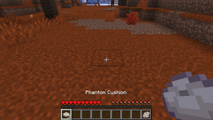
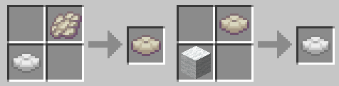

# Phantom Cushions

Phantom Cushions adds a craftable invisible cushion that works like a normal wool cushion, but disappears when placed.

---

The cushions become temporarily visible only when looking directly at them, or while holding a phantom cushion in your hand.

---

The phantom cushion can be crafted by combining any wool cushion with a phantom membrane. They only have one universal phantom color, but they can be crafted back into normal cushions by combining them with wool.

